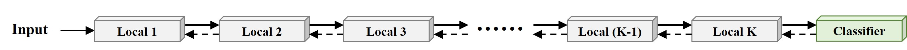
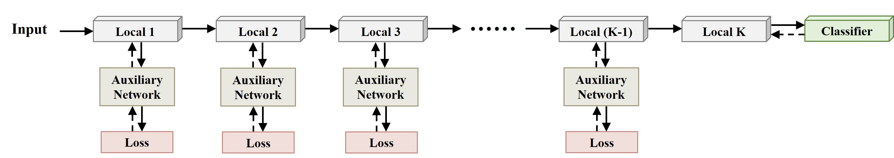
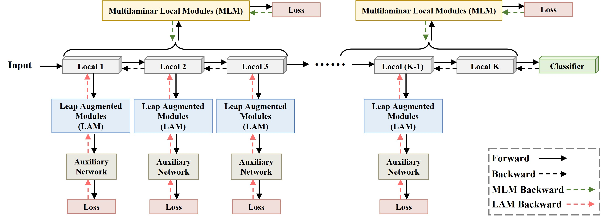

# MLAAN: Scaling Supervised Local Learning with Multilaminar Leap Augmented Auxiliary Network

Figure: E2E backpropagation

Figure: Other supervised local learning methods

Figure: Our proposed method

To Train on Different Datasets:
-------
>For CIFAR-10/STL-10/SVHN:
```bash
cd CIFAR-SVHN-STL
```
>>For eaxmple: ResNet-32 (K=16) on CIFAR-10:
```bash
CUDA_VISIBLE_DEVICES=0 python train.py --dataset cifar10 --model resnetMLAAN --layers 32 --droprate 0.0 --no 0 --cos_lr --local_module_num 16  --local_loss_mode cross_entropy --aux_net_widen 1 --aux_net_feature_dim 128 --ixx_1 5 --ixy_1 0.5 --ixx_2 0   --ixy_2 0  --momentum 0.995
```
>For ImageNet:
```bash
cd ImageNet
```
>>For eaxmple: ResNet-101 (K=34) on ImageNet:
```bash
CUDA_VISIBLE_DEVICES=0 python imagenet_DDP.py ./data/ --arch resnet34 --net resnet101 --workers 32 --epochs 150 --batch-size 64 --lr 0.05 --momentum 0.9 --momentum2 0.995 --local_module_num 34 --world-size 2  --rank 1 --dist-url 'tcp://127.0.0.1:29500' --dist-backend 'nccl' --gpu 0 --multiprocessing-distributed --ixx_r 5 --ixy_r 0.5
```
Citation:
--------
```bash
@misc{zhang2024mlaanscalingsupervisedlocal,
      title={MLAAN: Scaling Supervised Local Learning with Multilaminar Leap Augmented Auxiliary Network}, 
      author={Yuming Zhang and Shouxin Zhang and Peizhe Wang and Feiyu Zhu and Dongzhi Guan and Junhao Su and Jiabin Liu and Changpeng Cai},
      year={2024},
      eprint={2406.16633},
      archivePrefix={arXiv},
      primaryClass={cs.CV},
      url={https://arxiv.org/abs/2406.16633}, 
}
```
